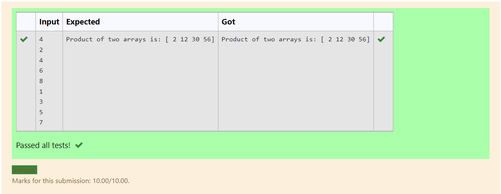

# Multiplying-two-matrix

## AIM:
To find the product of two arrays using numpy by using python programming.

## ALGORITHM:

Step 1:
Import Numpy as np.

Step 2:
Get input from the user.

Step 3:
Create empty lists l1 and l2.

Step 4:
Use for loop to append the values into the list created.

Step 5:
Print the product of two arrays.

## PROGRAM: 
````
Developed by : Dhanush.S
Ref No : 212221230020

import numpy as np
num1,num2=[],[]
n=int(input())
for i in range(n):
    num1.append(int(input()))
for i in range(n):
    num2.append(int(input()))
value1=np.array(num1)
value2=np.array(num2)
result=value1*value2
print("Product of two arrays is:",result)
````
## OUTPUT:


## RESULT:
Thus the Program is written to multipy two matrix.

